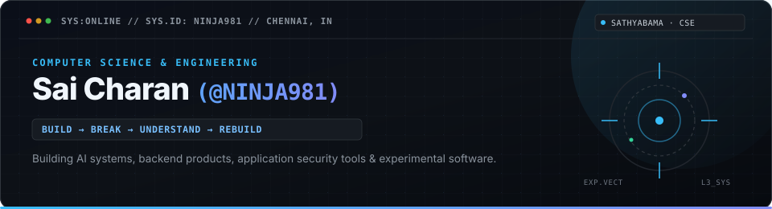
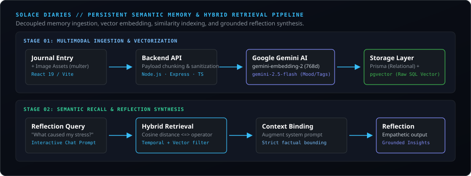
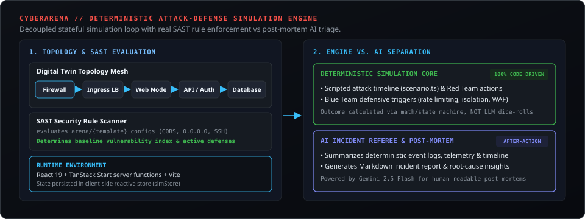
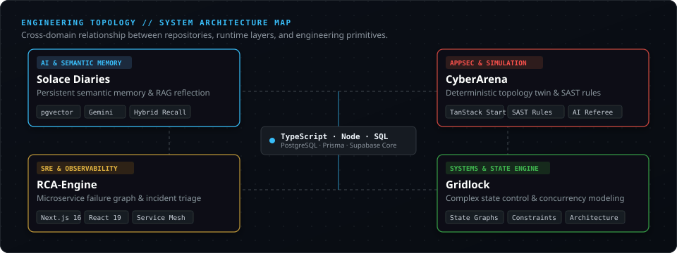
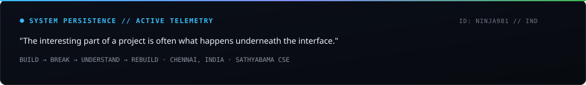

<div align="center">



<br>

<p align="center">
  <a href="#01--current-state"><code>// STATE</code></a> &nbsp;·&nbsp;
  <a href="#02--selected-work"><code>// SELECTED WORK</code></a> &nbsp;·&nbsp;
  <a href="#03--architecture-topology"><code>// TOPOLOGY</code></a> &nbsp;·&nbsp;
  <a href="#04--engineering-loadout"><code>// LOADOUT</code></a> &nbsp;·&nbsp;
  <a href="#05--engineering-principles"><code>// PRINCIPLES</code></a> &nbsp;·&nbsp;
  <a href="#06--contact"><code>// CONTACT</code></a>
</p>

</div>

---

### `POSITIONING`

> **Computer Science student building AI systems, backend products, security tools, and experimental software.**
> 
> *“I build things to understand how they work. The interesting part of a project is often what happens underneath the interface.”*

---

## `01 // CURRENT STATE`

<table>
<tr>
<td width="50%" valign="top">

### 📍 Profile Context

- **Name:** Sai Charan
- **Role:** CSE Student &amp; Software Builder
- **University:** Sathyabama Institute of Science and Technology
- **Location:** Chennai, India
- **Stage:** College student building production-grade software while systematically mastering CS fundamentals.

```text
OPERATING VECTOR
────────────────
AI Engineering        · Semantic memory & RAG
Backend Systems       · TypeScript, Node, SQL
Application Security  · SAST, CTFs & simulations
Core Fundamentals     · DSA (Java) & System Design
```

</td>
<td width="50%" valign="top">

### ⚡ Active Focus Matrix

```text
BUILDING (In Active Development)
├── Solace Diaries   [Semantic memory & RAG reflection]
├── CyberArena       [Deterministic AppSec simulation]
├── RCA-Engine       [SRE microservice failure analysis]
└── Gridlock         [State orchestration & constraints]

LEARNING (Deepening Fundamentals)
├── System Design    [API contracts, DB schemas, caching]
├── Advanced DSA     [Transferring Python base to Java]
├── AI Engineering   [pgvector, embeddings, agent flows]
└── App Security     [SAST rule sets & attack vectors]
```

</td>
</tr>
</table>

---

## `02 // SELECTED WORK`

Flagship repositories demonstrating engineering judgment, system architecture, and real execution.

---

### `01. SOLACE DIARIES` · `ONLINE`

**An AI journaling platform built around persistent semantic memory and hybrid retrieval.**

> Traditional journaling apps are static text archives where past insights get lost. Solace Diaries experiments with persistent semantic memory: transforming multi-modal journal entries into 768-dimensional vector coordinates so users can converse with their past through grounded reflection.

<p align="center">
  
</p>

<p align="center">
  <a href="https://github.com/NINJA981/Solace-Diaries">
    
  </a>
</p>

```text
STACK: TypeScript · Node.js · Express · Google Gemini 2.5 Flash · gemini-embedding-2 · PostgreSQL · Supabase · pgvector · Prisma · React 19 · Vite
```

<details>
<summary><kbd>▶</kbd> <strong>Deep Technical Notes: Semantic Memory &amp; pgvector Integration</strong></summary>
<br>

- **Why `pgvector` over dedicated vector DBs:** Kept relational metadata (dates, mood tags, user auth, image references) and high-dimensional embeddings inside a single transactional PostgreSQL store, avoiding distributed consistency sync issues.
- **Prisma + Raw SQL Boundary:** Prisma manages relational migrations and typed schemas, while high-performance cosine similarity searches (`<=>` operator) and vector distance queries are executed via raw SQL transactions over indexed vector columns.
- **Decoupled Intelligence Flow:** Entry payloads pass through `gemini-embedding-2-preview` to generate 768-dimensional coordinates, while `gemini-2.5-flash` extracts emotional nuances and metadata tags concurrently.
- **Strict Grounding:** Chat prompts are explicitly bounded to retrieved cosine-nearest entry chunks to eliminate hallucination and deliver cited reflections.

</details>

---

### `02. CYBERARENA` · `ONLINE`

**A simulated application security battlefield with deterministic execution and digital twin topology.**

> CyberArena models a full enterprise network topology (Firewall → Load Balancer → Web Nodes → API Gateway → Auth → Database) and simulates real-time attack/defense sequences. Crucially, the simulation is **100% deterministic**—code and SAST security rules govern the outcome, while AI is used strictly for after-action triage and post-mortems.

<p align="center">
  
</p>

<p align="center">
  <a href="https://github.com/NINJA981/CyberArena">
    
  </a>
</p>

```text
STACK: React 19 · TanStack Start · TypeScript · Vite · SAST Scanner · Google Gemini 2.5 Flash · Tailwind CSS v4
```

<details>
<summary><kbd>▶</kbd> <strong>Deep Technical Notes: Deterministic Engine vs. LLM Hallucination</strong></summary>
<br>

- **Simulation Core vs. AI Separation:** Security simulations cannot rely on generative model randomness. The simulation loop advances via `requestAnimationFrame`, calculating node health, compromise status, and lateral movement from explicit rule graphs and configuration states.
- **Arena Workspace &amp; SAST Scanner:** Dynamic workspace scaffolder generates intentional misconfigurations (`arena/{template}/`), which the internal SAST scanner parses (detecting unrestricted ingress `0.0.0.0/0`, exposed SSH, weak secrets) to set base risk indexes.
- **Post-Mortem AI Referee:** Once the deterministic battle concludes, event telemetry and timeline logs are passed to `gemini-2.5-flash` to synthesize an incident report and actionable remediation recommendations.

</details>

---

### `03. RCA-ENGINE` · `ONLINE`

**AI-powered root-cause analysis and incident response dashboard for microservice architectures.**

> An SRE incident response tool that visualizes microservice dependencies, monitors real-time telemetry (latency, error rates, CPU/memory saturation), detects cascading failures, and generates natural-language RCA summaries with actionable remediation playbooks.

```text
Service Health Metrics ──→ Dependency Graph ──→ Anomaly Detection ──→ AI RCA Synthesis ──→ Remediation Steps
```

<p align="center">
  <a href="https://github.com/NINJA981/RCA-Engine">
    
  </a>
</p>

```text
STACK: Next.js 16 · React 19 · Tailwind CSS 4 · TypeScript 5.7 · Microservice Dependency Graphs · AI Incident Analysis
```

<details>
<summary><kbd>▶</kbd> <strong>Deep Technical Notes: Dependency Graphs &amp; Incident Triage</strong></summary>
<br>

- **Interactive Topology Graph:** Color-coded service nodes (`green`/healthy, `amber`/degraded, `red`/critical) with dynamic connection flow lines indicating traffic health and failure propagation paths.
- **Cost of Downtime &amp; Severity Tracking:** Real-time calculation engine with timeline traces and keyboard-driven shortcut navigation (`/` search).
- **Incident Remediation:** Diagnostic summary identifies primary root causes vs upstream symptoms to reduce Mean Time to Resolution (MTTR).

</details>

---

### `04. GRIDLOCK` · `BUILDING`

**Systems &amp; state engineering project focused on managing complex distributed state and constraints.**

> Investigating how state machines, concurrency controls, and constraint satisfaction algorithms behave when managing complex interconnected components.

<p align="center">
  <a href="https://github.com/NINJA981/Gridlock">
    
  </a>
</p>

```text
FOCUS: Distributed State Management · State Machine Modeling · Concurrency Controls · System Reliability
```

---

### `05. ADDITIONAL SYSTEMS &amp; EXPERIMENTS`

<details>
<summary><kbd>+</kbd> <strong>Expand Archive Repositories</strong></summary>
<br>

| Project | Domain | Key Architecture &amp; Tech | Repository |
|:---|:---|:---|:---:|
| **EQUUS / ZooLearn** | Interactive Simulation &amp; AI Vision | 55M-year evolutionary natural selection sandbox (*GenEquus*), AI Paleontologist Desk with canvas sketchpad analysis via **Gemini 2.5 Flash**, and geological excavation stratum grid. | [View Repo](https://github.com/NINJA981/zoolearn) |
| **VocalPulse (Call-Centre Engine)** | AI Speech &amp; Sales Telemetry | AI-powered dialer &amp; tracking system: multi-tenant lead management, Twilio VoIP / mobile SIM tracking, Whisper speech-to-text, and GPT-4o conversation intelligence. | [View Repo](https://github.com/NINJA981/Call-centre-Hackathon-project) |
| **ZeroX** | Developer Tooling &amp; Experiments | Experimental software utilities and research codebase. | [View Repo](https://github.com/NINJA981/ZeroX) |

</details>

---

## `03 // ARCHITECTURE TOPOLOGY`

How active repositories map across paradigms and infrastructure layers:

<p align="center">
  
</p>

---

## `04 // ENGINEERING LOADOUT`

Organized strictly by active implementation experience:

<table>
<tr>
<td width="33%" valign="top">

### 💻 Languages
- **TypeScript** *(Primary)*
- **JavaScript**
- **Java** *(DSA focus)*
- **Python**
- **C**

</td>
<td width="33%" valign="top">

### ⚙️ Backend &amp; Data
- **Node.js** · **Express**
- **PostgreSQL** · **pgvector**
- **Supabase** · **Prisma ORM**
- **REST APIs** · Database Design
- Raw SQL Vector Operations

</td>
<td width="33%" valign="top">

### 🧠 AI &amp; Retrieval
- **Google Gemini** *(2.5 Flash)*
- **Gemini Embeddings** *(768d)*
- **RAG &amp; Hybrid Search**
- Semantic Memory Maps
- AI Agent Workflows

</td>
</tr>
<tr>
<td width="33%" valign="top">

### 🎨 Frontend
- **React 19** · **React 18**
- **Next.js 16** · **TanStack**
- **Tailwind CSS** *(v3 &amp; v4)*
- **Vite** · HTML5 / Canvas

</td>
<td width="33%" valign="top">

### 🛡️ Security Lab
- **SAST Rule Evaluation**
- **Burp Suite** · **CTFs (picoCTF)**
- Web Vulnerability Analysis
- Attack Path Simulation
- Web Security Academy

</td>
<td width="33%" valign="top">

### 🛠️ Toolchain
- **Git** · **GitHub**
- **VS Code** · **Linux**
- **Vercel** · **Render** · **Netlify**
- **Postman** · **npm / bun**

</td>
</tr>
</table>

---

## `05 // ENGINEERING PRINCIPLES`

Core rules governing how I approach software design and problem solving:

```text
01 // BUILD OVER TUTORIAL CONSUMPTION
The fastest path to deep comprehension is building real systems from scratch rather than passively watching walkthroughs.

02 // UNDERSTAND UNDERNEATH THE ABSTRACTION
If I use an ORM, framework, or library, I want to know how the raw SQL, runtime loop, or network socket functions beneath it.

03 // AI ACCELERATES ENGINEERING, NOT UNDERSTANDING
Use AI to eliminate boilerplate and assist analysis, never as a substitute for knowing your system's fundamental mechanics.

04 // PROJECTS ARE EXPERIMENTS FOR LEARNING SYSTEMS
Every repository is a controlled laboratory for testing architectural patterns, data structures, and edge cases.

05 // EMBRACE FAILURE AS TELEMETRY
When code breaks or a simulation crashes, the failure provides the highest-signal insight into how the system really works.
```

---

## `06 // CONTACT`

<div align="center">

**Interested in collaborating on AI systems, backend architecture, security simulations, or hackathons?**

<br>

<a href="https://github.com/NINJA981">
  
</a>
&nbsp;
<a href="https://www.linkedin.com/in/sai-charan-9b8143282/">
  
</a>
&nbsp;
<a href="mailto:contact@ninja981.dev">
  
</a>

<br><br>



</div>
