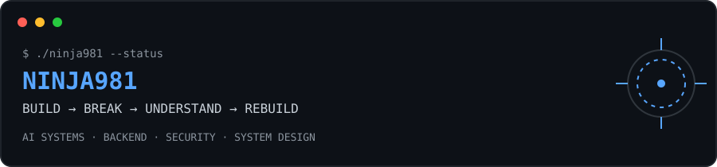

<div align="center">

# `NINJA981`

### `BUILD → BREAK → UNDERSTAND → REBUILD`

<a href="#-system-status">SYSTEM</a> ·
<a href="#-active-systems">PROJECTS</a> ·
<a href="#-loadout">LOADOUT</a> ·
<a href="#-field-record">FIELD RECORD</a> ·
<a href="#-telemetry">TELEMETRY</a> ·
<a href="#-contact">CONTACT</a>

<br>



</div>

---

## `01 // SYSTEM STATUS`

<table>
<tr>
<td width="52%" valign="top">

```text
IDENTITY
────────
Sai Charan
Computer Science & Engineering

ROLE
────
Student / Builder / Experimenter

CURRENT VECTOR
──────────────
AI systems
Backend engineering
Security
System design
DSA

OPERATING MODE
─────────────
BUILDING REAL THINGS
THEN TAKING THEM APART
TO UNDERSTAND WHY THEY WORK
```

</td>
<td width="48%" valign="top">

### Current mission

I'm interested in the layer between **"it works"** and **"I understand the system."**

Right now that means:

- building AI products beyond simple API wrappers
- getting deeper into RAG, embeddings and agent systems
- learning system design through actual projects
- strengthening DSA with Java
- exploring application security and attack paths

</td>
</tr>
</table>

> **Signal over stack lists. Projects over claims.**

---

## `02 // ACTIVE SYSTEMS`

These are the repositories I'd point you to first.

### `SOLACE DIARIES` · `ONLINE`

**An AI journaling system built around semantic memory.**

```text
JOURNAL
   │
   ├── text + images
   ↓
EMBEDDING
   ↓
SEMANTIC MEMORY
   ↓
HYBRID RETRIEVAL
   ├── vector search
   ├── metadata / structured signals
   └── contextual recall
   ↓
REFLECTION
```

**Interesting part:** the goal isn't just "chat with your journal". The system is designed around persistent semantic memory, retrieval and reflection.

`Gemini` `Embeddings` `PostgreSQL` `pgvector` `Prisma` `TypeScript`

→ **[inspect repository](https://github.com/NINJA981/Solace-Diaries)**

<details>
<summary><kbd>⌁</kbd> open technical notes</summary>

- Embeddings are stored in PostgreSQL through `pgvector`.
- Prisma handles the relational layer while vector operations use SQL where required.
- Retrieval is treated as a system component rather than an afterthought to the UI.
- The architecture is evolving toward journal + image memory → hybrid retrieval → reflection.

</details>

---

### `CYBERARENA` · `ONLINE`

**A simulated application-security battlefield.**

```text
APPLICATION TOPOLOGY
        ↓
 VIRTUAL NETWORK
        ↓
 ┌───────────────┐
 │   RED TEAM    │──────→ exploit / lateral movement
 └───────────────┘
          ↕
 ┌───────────────┐
 │   BLUE TEAM   │←────── detect / contain / recover
 └───────────────┘
        ↓
CRS / THREAT / OUTCOME
```

The simulation itself is deterministic. AI is used as an **optional post-simulation referee**, not as the engine deciding what happened.

`React 19` `TanStack Start` `TypeScript` `SAST` `Gemini` `Vite`

→ **[enter CyberArena](https://github.com/NINJA981/CyberArena)**

<details>
<summary><kbd>⌁</kbd> open technical notes</summary>

CyberArena models an application topology and runs scripted attack/defense events against it.

The engine tracks node health, risk, protections, attack progression and resilience metrics. Security rules can affect whether an attack succeeds.

That separation is deliberate:

```text
CORE SIMULATION = deterministic
AI REPORTING    = optional
```

</details>

---

### `GRIDLOCK` · `BUILDING`

**A systems/problem-solving project focused on making complex state manageable.**

→ **[open repository](https://github.com/NINJA981/Gridlock)**

---

### `RCA ENGINE` · `ONLINE`

**Root-cause analysis tooling.**

→ **[open repository](https://github.com/NINJA981/RCA-Engine)**

---

<details>
<summary><kbd>+</kbd> more systems</summary>

**ZooLearn** · [repository](https://github.com/NINJA981/zoolearn)

**Call Centre Hackathon Project** · [repository](https://github.com/NINJA981/Call-centre-Hackathon-project)

**ZeroX** · [repository](https://github.com/NINJA981/ZeroX)

</details>

---

## `03 // LOADOUT`

<table>
<tr>
<td valign="top" width="33%">

### LANGUAGES

`TypeScript`  
`JavaScript`  
`Java`  
`Python`  
`C`

</td>
<td valign="top" width="33%">

### BUILD

`React`  
`Node.js`  
`Express`  
`PostgreSQL`  
`Prisma`  
`Tailwind`

</td>
<td valign="top" width="33%">

### AI / DATA

`RAG`  
`Embeddings`  
`Vector Search`  
`LLM APIs`  
`pgvector`  
`Agent systems`

</td>
</tr>
</table>

### Toolchain

`Git` · `GitHub` · `Supabase` · `Vercel` · `Render` · `VS Code` · `Linux`

---

## `04 // LEARNING TREE`

```text
COMPUTER SCIENCE
│
├── DSA
│   ├── Arrays / Hashing
│   ├── Sliding Window
│   ├── Binary Search
│   ├── Trees
│   └── Graphs
│
├── SYSTEM DESIGN
│   ├── APIs
│   ├── Databases
│   ├── Caching
│   ├── Scalability
│   └── Distributed Systems
│
├── AI SYSTEMS
│   ├── Embeddings
│   ├── RAG
│   ├── Retrieval
│   ├── Agents
│   └── Evaluation
│
└── SECURITY
    ├── Web Security
    ├── CTFs
    ├── SAST
    └── Attack Paths
```

**Current target:** move from knowing how to use systems to understanding how to design them.

---

## `05 // FIELD RECORD`

```text
2026
│
├── 🥇  Hack the Vibe
│    1st place
│
├── 🥇  Code in the Dark
│    1st place
│
├── 🏆  VIT Hackcrate
│    Top 5
│
├── 🏅  Luminary Award
│    All-Rounder Excellence
│
└── 🎤  Technical workshops / community events
     building + teaching around developer tooling
```

No participation trophies in the telemetry.

---

## `06 // TERMINAL`

```text
$ whoami
NINJA981

$ current_mission
Build systems worth understanding.

$ strongest_signal
shipping > talking

$ next_target
system design

$ side_quest
break things in controlled environments

$ status
LEARNING / BUILDING / SHIPPING
```

---

## `07 // TELEMETRY`

<div align="center">


<br>


</div>

<sub>Telemetry is deliberately kept secondary. The repositories are the evidence.</sub>

---

## `08 // DEBUG MODE`

<details>
<summary><kbd>↑ ↑ ↓ ↓ ← → ← → B A</kbd> &nbsp; execute</summary>

```text
DEBUG MODE
──────────

If you found this section, you explored farther than most.

There isn't a secret project here.

The point was the interface.

Good software should reward curiosity.
```

</details>

---

## `09 // CONTACT`

<div align="center">

**Want to build, break, test or discuss something?**

[GitHub](https://github.com/NINJA981) ·
[LinkedIn](https://www.linkedin.com/) ·
[Portfolio](#)

<br>

```text
SYSTEM STATUS
████████████████████████████████  ONLINE

SESSION END
───────────
the build continues.
```

</div>
